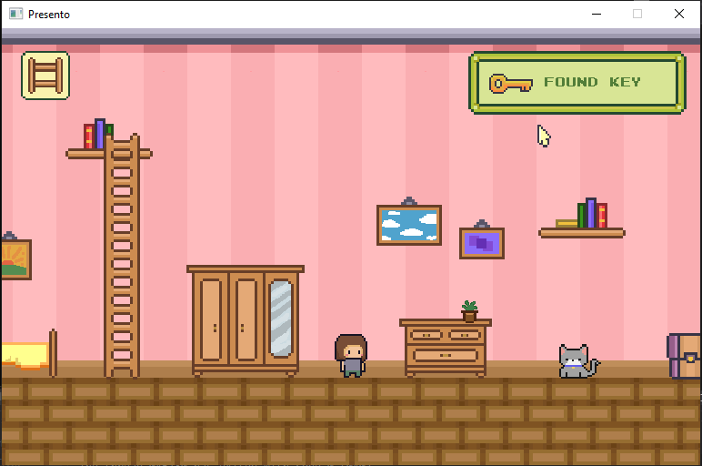

# Presento

A small platformer puzzle game made as a birthday present with SDL2 and C++.

---

## Controls

- WASD to move
- Enter to interact with objects
- P to place items
- O to pick items up

## Features

- Sprite management and animation
- AABB collision detection
- Keyboard and mouse event handling
- Basic 2d platformer physics

## Demo

